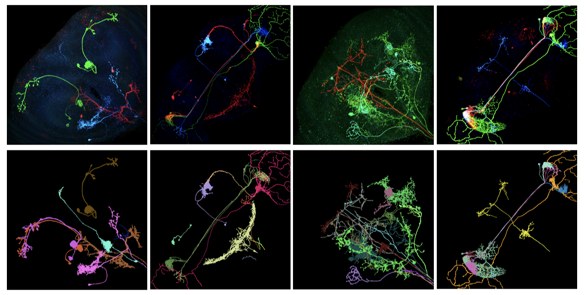

<h1 align="center">FISBe: A real-world benchmark dataset for instance segmentation of long-range thin filamentous structures
</h1>




## About

⚠️ *Currently under construction.*

This is the official implementation of the **FISBe (FlyLight Instance Segmentation Benchmark)**
evaluation pipeline, the first publicly available multi-neuron light microscopy dataset with
pixel-wise annotations. 

You can download the dataset on the official project page:

👉 https://kainmueller-lab.github.io/fisbe/

The benchmark supports 2D and 3D segmentations and computes a wide range of commonly used evaluation
metrics (e.g., AP, F1, coverage, precision, recall). Additionally, it provides a visualization
of segmentation errors.

Overview:
-------------
This toolkit provides:

- Standard and FlyLight-specific evaluation metrics
- Error attribution (false merges, splits, FP/FN instances)
- Visualizations for neurons and nuclei
- Support for partially annotated datasets
- Coverage metrics (skeleton, dimension-based, overlap-based)
- Command-line and Python API usage

-------------

Installation:
-------------
The recommended way is to install it into your micromamba/python virtual environment.

```bash
git clone https://github.com/Kainmueller-Lab/evaluate-instance-segmentation
cd evaluate-instance-segmentation

micromamba create -n evalinstseg -f environment.yml
micromamba activate evalinstseg

pip install -e .
```

## Run Benchmark

You can use this repository in two ways:

1. As a Python package (via `evaluate_file` / `evaluate_volume`)
2. From the command line

Example:
```bash
evalinstseg \
  --res_file tests/pred/R14A02-20180905_65_A6.hdf \
  --res_key volumes/gmm_label_cleaned \
  --gt_file tests/gt/R14A02-20180905_65_A6.zarr \
  --gt_key volumes/gt_instances \
  --out_dir tests/results \
  --app flylight
```

By setting `--app flylight`, the pipeline automatically uses the default FlyLight benchmark configuration.

You can also define custom configurations, including:
- localization criteria
- assignment strategy
- metric subsets

Output:

- evaluation metrics are written to toml-file and returned as dict


## Metrics Overview:
The evaluation computes metrics at multiple levels: per-threshold instance metrics, aggregated AP/F-scores, and global statistics

### Instance-Level Metrics (per threshold confusion_matrix.th_*)
| Metric                      | Description                              |
| --------------------------- | ---------------------------------------- |
| **AP_TP**                   | True positives at threshold              |
| **AP_FP**                   | False positives at threshold             |
| **AP_FN**                   | False negatives at threshold             |
| **precision**               | TP / (TP + FP)                           |
| **recall**                  | TP / (TP + FN)                           |
| **AP**                      | Approximate AP proxy: precision × recall |
| **fscore**                  | Harmonic mean of precision and recall    |
| *optional:* **false_split** | Number of false splits                   |
| *optional:* **false_merge** | Number of false merges                   |

Metrics are computed for thresholds:
0.1, 0.2, ..., 0.9, 0.55, 0.65, 0.75, 0.85, 0.95.

### Aggregate Metrics
| Metric         | Description                         |
| -------------- | ----------------------------------- |
| **avAP**       | Mean AP for thresholds ≥ 0.5        |
| **avAP59**     | AP averaged over thresholds 0.5–0.9 |
| **avAP19**     | AP averaged over thresholds 0.1–0.9 |
| **avFscore**   | Mean F-score for thresholds 0.1–0.9 |
| **avFscore59** | Mean F-score for thresholds 0.5–0.9 |
| **avFscore19** | Mean F-score for thresholds 0.1–0.9 |

### General Metrics
| Metric                 | Description                                      |
| ---------------------- | ------------------------------------------------ |
| **Num GT**             | Number of ground-truth instances                 |
| **Num Pred**           | Number of predicted instances                    |
| **TP_05**              | True positives at threshold 0.5                  |
| **TP_05_rel**          | TP_05 / Num GT                                   |
| **TP_05_cldice**       | clDice scores of matched pairs at threshold 0.5  |
| **avg_TP_05_cldice**   | Mean clDice over matched pairs at threshold 0.5  |

### Optional General Metrics 
| Metric                  | Description |
| ----------------------- | ----------- |
| **avg_gt_skel_coverage** | Mean skeleton coverage over all GT instances |
| **avg_tp_skel_coverage** | Mean skeleton coverage over TP GT instances (> 0.5) |
| **avg_f1_cov_score**     | 0.5 × avFscore19 + 0.5 × avg_gt_skel_coverage |
| **FM**                   | Many-to-many false merge score (threshold `fm_thresh`) |
| **FS**                   | Many-to-many false split score (threshold `fs_thresh`) |
| **avg_gt_cov_dim**       | Mean GT coverage for “dim” instances |
| **avg_gt_cov_overlap**   | Mean GT coverage for overlapping-instance regions |

